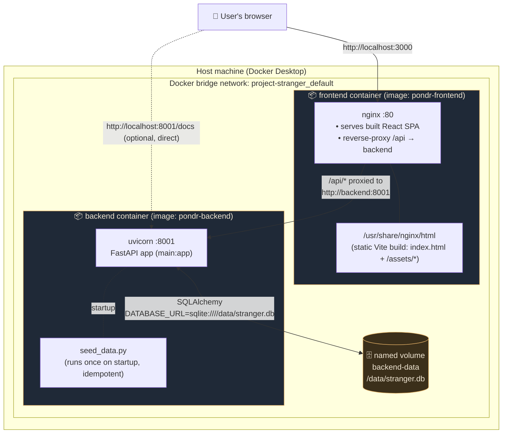
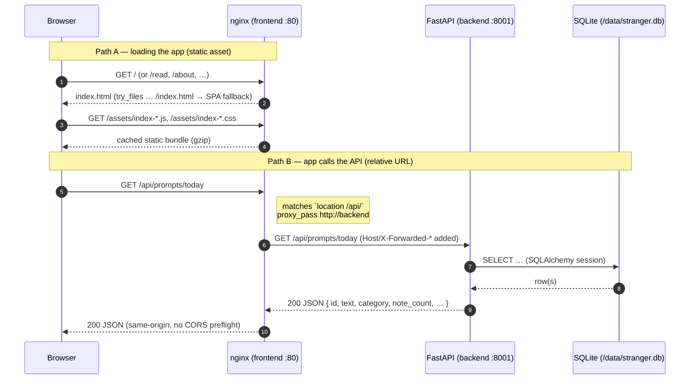
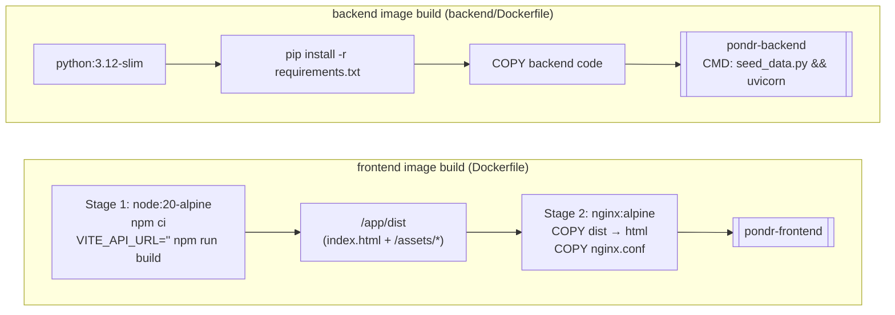
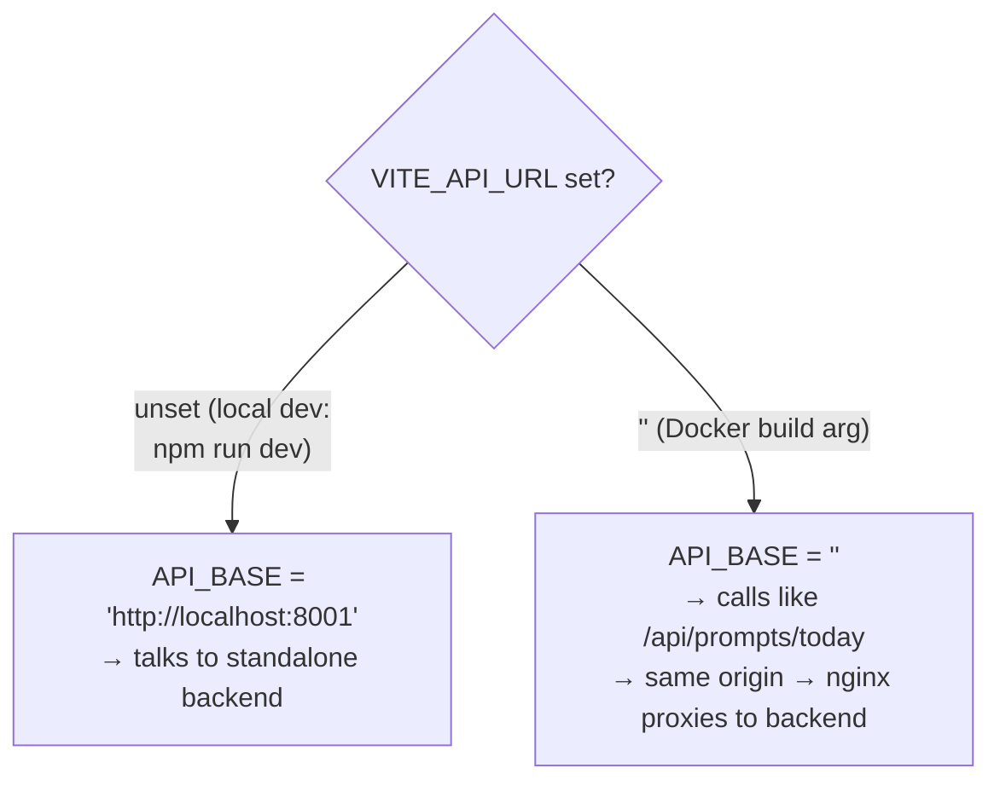
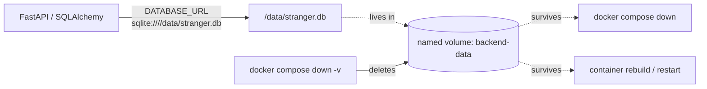

# Pondr — Containerised Architecture

How the Dockerised app fits together: what each container does, how a browser
request flows through the system, how the images are built, and how data
persists. All diagrams are [Mermaid](https://mermaid.js.org/) — they render on
GitHub and in VS Code (install the "Markdown Preview Mermaid Support" extension).

---

## 1. The big picture

Two containers, orchestrated by Docker Compose on a private bridge network. The
browser only ever talks to **one origin** (the frontend), which serves the React
app and reverse-proxies API calls to the backend — so there is no cross-origin
(CORS) problem to configure.



**Why this shape?**
- **Single public origin** (`:3000`) → the browser never makes a cross-origin
  request, so the FastAPI CORS list never needs to know the deploy URL.
- **Backend not required to be public** — `:8001` is published only as a
  convenience for hitting `/docs` directly; in production you can drop that port
  and expose only the frontend.
- **SQLite on a named volume** → data survives `docker compose down` and
  container rebuilds.

---

## 2. How a request flows

Two distinct paths depending on what the browser asks for. nginx decides based
on the URL path.



The frontend code calls the API with **relative** paths (e.g.
`/api/prompts/today`) because it was built with `VITE_API_URL=""`. That empty
base is what keeps everything same-origin — see §4.

nginx route table (from `nginx.conf`):

| Request path             | nginx action                                  |
|--------------------------|-----------------------------------------------|
| `/api/*`                 | `proxy_pass` → `backend:8001` (path preserved)|
| `/health`, `/docs`, `/openapi.json`, `/redoc` | `proxy_pass` → backend       |
| everything else          | serve file, else fall back to `index.html`    |

---

## 3. How the images are built

The frontend uses a **multi-stage build**: a heavy Node image compiles the
static assets, then only the compiled output is copied into a tiny nginx image.
The Node toolchain never ships in the final image.



Build-time vs run-time, at a glance:

| Concern        | Frontend                                  | Backend                          |
|----------------|-------------------------------------------|----------------------------------|
| Base (build)   | `node:20-alpine`                          | —                                |
| Base (run)     | `nginx:alpine`                            | `python:3.12-slim`               |
| Build command  | `npm ci` → `npm run build`                | `pip install -r requirements.txt`|
| Runtime cmd    | `nginx -g 'daemon off;'`                  | `seed_data.py && uvicorn …:8001` |
| Build arg      | `VITE_API_URL` (default `""`)             | —                                |

---

## 4. The `VITE_API_URL` trick (why API calls are same-origin)

Vite **inlines** environment variables at build time. `src/api/client.js` reads:

```js
const API_BASE = import.meta.env.VITE_API_URL ?? 'http://localhost:8001';
```



Using `??` (not `||`) is the key: `||` would treat an empty string as falsy and
wrongly fall back to `localhost:8001`. `??` only falls back on `null`/`undefined`,
so an explicit `""` is honoured. To point the frontend at a backend on a
different host (e.g. a split deploy), rebuild with
`--build-arg VITE_API_URL=https://api.example.com`.

---

## 5. Data & persistence



- `backend/database.py` reads `DATABASE_URL` from the environment, defaulting to
  a local file (`sqlite:///./stranger.db`) so non-Docker dev is unchanged.
  Compose overrides it to `sqlite:////data/stranger.db` (4 slashes = absolute
  path `/data/stranger.db`) on the mounted volume.
- `seed_data.py` runs on every startup but **skips if the DB is already
  populated** (`if db.query(Prompt).count() > 0: return`), so restarts don't
  duplicate data.
- **Swap to Postgres** with no code changes: set `DATABASE_URL` to the Postgres
  URL and add `psycopg2-binary` to `requirements.txt`. The
  `check_same_thread` SQLite arg is applied conditionally, so non-SQLite URLs
  work as-is.

---

## 6. Local dev vs Docker

The two ways to run the app, side by side:

| Aspect            | Local dev (`npm run dev` + uvicorn)        | Docker (`docker compose up`)              |
|-------------------|--------------------------------------------|-------------------------------------------|
| Frontend served by| Vite dev server (HMR) on `:3000`           | nginx (static build) on `:3000`           |
| API base URL      | `http://localhost:8001` (cross-origin)     | `""` → `/api` (same-origin via proxy)     |
| CORS              | relies on backend CORS allow-list          | not needed (single origin)                |
| Database          | `./backend/stranger.db` file               | `/data/stranger.db` on a volume           |
| Backend run       | `py -3.12 -m uvicorn main:app --reload`    | container `CMD` (seed → uvicorn)          |
| Start command     | two terminals                              | one command                               |

> ⚠️ **Port gotcha:** if a `npm run dev` server is already running it binds
> `localhost:3000` on IPv6 (`[::1]`), which `localhost` resolves to first and
> shadows Docker's `0.0.0.0:3000`. When both could be up, reach the Docker app
> via **`http://127.0.0.1:3000`**, or stop the dev server.

---

## 7. File map

| File                 | Role                                                        |
|----------------------|-------------------------------------------------------------|
| `docker-compose.yml` | Orchestrates both services, network, ports, volume, env     |
| `Dockerfile`         | Frontend multi-stage build (Node → nginx)                   |
| `nginx.conf`         | SPA serving + `/api` reverse proxy                          |
| `.dockerignore`      | Keeps `node_modules`, `dist`, `backend/` out of FE context  |
| `backend/Dockerfile` | Backend image (Python + FastAPI + SQLite)                   |
| `backend/.dockerignore` | Excludes `__pycache__`, local `*.db`                     |
| `DOCKER.md`          | Quick-start + command reference                             |
| `ARCHITECTURE.md`    | This document                                               |

---

## 8. Verified behaviour

This setup was built and run end-to-end (`docker compose up --build`) and
confirmed:

- ✅ Both images build (`vite build` succeeds; backend installs deps)
- ✅ `frontend` serves the production bundle (`/assets/index-*.js`, no dev `/@vite`)
- ✅ nginx proxies `/api/prompts/today` → backend → seeded JSON (`note_count: 6`)
- ✅ backend `/health` → `200 {"status":"healthy"}`, container reports healthy
- ✅ data seeded once via `seed_data.py` on startup
